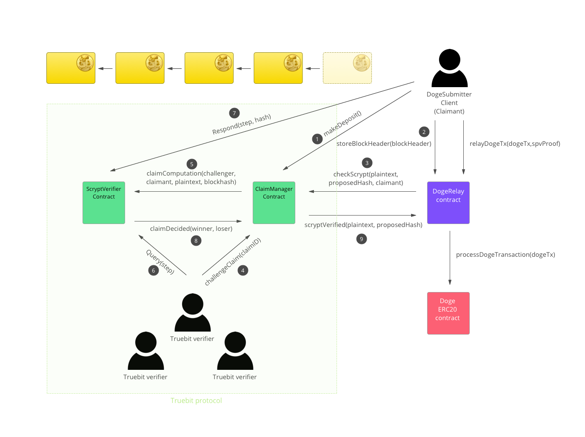

[](https://travis-ci.org/TrueBitFoundation/scrypt-interactive)

# Truebit Verification for Scrypt.

## Overview

This repo provides a proof-of-concept implementation of the Truebit smart contract system.<br/>

It enables a step-by-step running and verification of the [Scrypt](https://en.wikipedia.org/wiki/Scrypt) hashing function on the EVM.<br/>

This can form the basis of a Dogecoin/Ethereum relay. Dogecoin uses Scrypt for its Proof-of-Work algorithm, specifically to calculate the block hash. Therefore, an ability to compute Scrypt hashes is required in order to verify the validity of Dogecoin transactions, as it allows one to check Merkle proofs from a known block header. This computation is too large given Ethereum's gas constraints, making it an ideal use case for Truebit.<br/>

For more context on how relays work, look at the [BTCRelay](https://github.com/ethereum/btcrelay) project.<br/>



## Running the Tests

If you are on a Linux machine you can simply install dependencies with this command:
```
./install.sh
```

Else you will need to have parity, which can be done by downloading a binary release for your machine from [here](https://github.com/paritytech/parity/releases)

Ensure you have the latest version of node installed.

You will need a testrpc and truffle:

```
npm install -g ganache-cli truffle
```

Then install packages deps:

```
npm install
```

Then, you can run tests by executing the `run.sh` script:
```
./run.sh

```

Or you can run parity with this config:

```
parity --config config.toml --geth
```

In a separate terminal window run ganache-cli
```
ganache-cli
```

Then run the tests with:
```
truffle test
```

## Doge-Ethereum bounty split contract

 The bounty contract is deployed at: `0x1ed3e252dcb6d540947d2d63a911f56733d55681`
