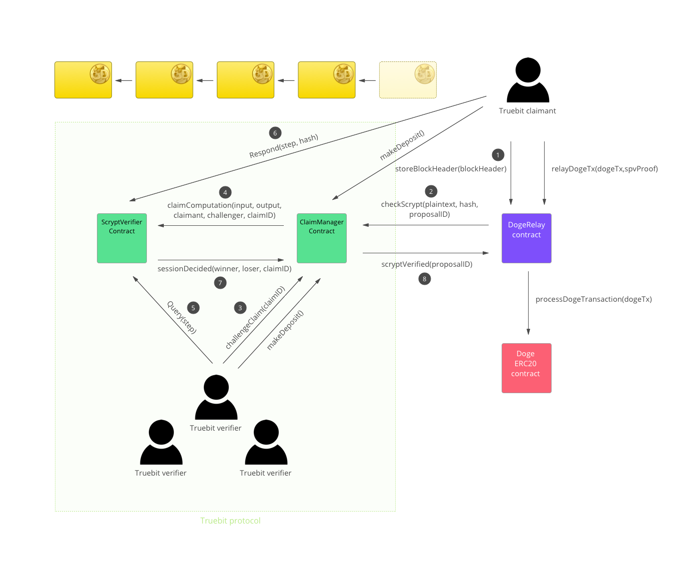

[](https://travis-ci.org/TrueBitFoundation/scrypt-interactive)

# Truebit Verification for Scrypt.

## Overview

This repo provides a proof-of-concept implementation of the Truebit smart contract system.<br/>

It enables a step-by-step running and verification of the [Scrypt](https://en.wikipedia.org/wiki/Scrypt) hashing function on the EVM.<br/>

This can form the basis of a Dogecoin/Ethereum relay. Dogecoin uses Scrypt for its Proof-of-Work algorithm, specifically to calculate the block hash. Therefore, an ability to compute Scrypt hashes is required in order to verify the validity of Dogecoin transactions, as it allows one to check Merkle proofs from a known block header. This computation is too large given Ethereum's gas constraints, making it an ideal use case for Truebit.<br/>

For more context on how relays work, look at the [BTCRelay](https://github.com/ethereum/btcrelay) project.<br/>



## Running the Tests

After cloning the repo, make sure you have the zeppelin libraries. If you want to use `run.sh`, also make sure you have `ganache-cli`:<br/>
```
#To get the zeppelin solidity libraries:
npm install zeppelin-solidity

#To geth ganache-cli(formerly testrpc):
npm install ganache-cli
```
After that just run `./run.sh`.<br/>

If you want to run anything other than `ganache-cli`, run it and then run `truffle test`.<br/>

## Tool Versions

For solidity, make sure you are using `0.18.0` or up. Refrain from using nightly builds. If you have to build your solidity, first look at [here](https://github.com/ethereum/solidity/releases) and then get the source from the tarball(don't clone the solidity repo).<br/>
